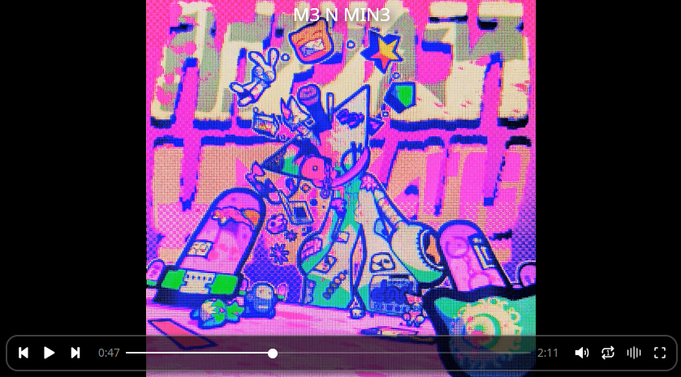
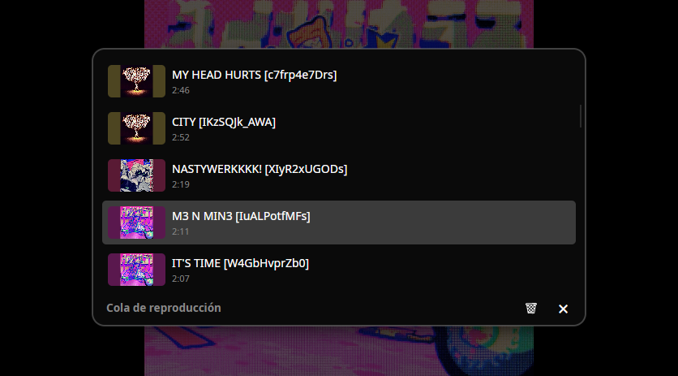

# MediaPlayer

[](https://dotnet.microsoft.com/)

[](https://github.com/1R1an1/MediaPlayer/commits/master/)
[](https://github.com/1R1an1/MediaPlayer)

Reproductor de video nativo para Linux, construido con Avalonia UI y libmpv.
Controles en tema oscuro sobre el reproductor, integración con el escritorio vía MPRIS2 (GNOME, KDE, etc), y atajos de teclado estilo mpv.

---

## Capturas

### Reproductor



### Playlist



---

## Formatos soportados

- Video: `.mp4` `.mkv` `.webm` `.avi` `.mov` `.flv` `.wmv` `.mpg` `.mpeg` `.m4v` `.ts`
- Audio: `.mp3` `.flac`

---

## Requisitos

| Requisito         | Detalle                              |
| ----------------- | ------------------------------------ |
| .NET SDK          | **10.0+**                            |
| Sistema operativo | Linux                                |
| libmpv            | `libmpv2`                            |
| ffmpeg / ffprobe  | Para extracción de covers y duración |

---

## Instalación

El repositorio incluye SharpUtils y TermFlow.Net como submódulos.

Clonar con `--recursive`:

```bash
git clone --recursive https://github.com/1R1an1/MediaPlayer.git
cd MediaPlayer
```

O, si ya estaba clonado sin `--recursive`, inicializar los submódulos:

```bash
git clone https://github.com/1R1an1/MediaPlayer.git
cd MediaPlayer
git submodule update --init --recursive
```

Compilar e instalar:

```bash
dotnet publish -c Release -r linux-x64 --self-contained true
sudo ln -sf $(realpath ./bin/Release/net10.0/linux-x64/publish/MediaPlayer) /usr/local/bin/mp
```

Uso:

```bash
mp                              # Abre la GUI sin archivos
mp video.mkv ~/carpeta          # Abre la GUI con uno o más archivos/carpetas
mp --nogui video.mkv            # Fuerza la TUI en lugar de la GUI
```

La TUI también se activa automáticamente si no hay un `DISPLAY` disponible (sesiones SSH, terminales headless).

---

## Descarga de videos y música

MediaPlayer usa las miniaturas embebidas en los archivos para mostrar la portada en la playlist y en MPRIS. Para audio (`.mp3` y `.flac`) la miniatura funciona de forma universal, pero para video (`.mkv`) requiere un formato específico. El script [`yt.sh`](https://github.com/1R1an1/MediaPlayer/blob/master/yt.sh) usa `yt-dlp` con las opciones correctas para que las miniaturas y los metadatos queden embebidos con el formato compatible de la app.

Uso del script [`yt.sh`](https://github.com/1R1an1/MediaPlayer/blob/master/yt.sh)

```bash
./yt.sh video <URL>              # Descarga video en .mkv con miniatura y metadatos embebidos
./yt.sh musica <mp3|flac> <URL>  # Descarga solo audio con miniatura y metadatos embebidos
./yt.sh musicaR <mp3|flac> <URL> # Igual que musica, pero recorta la miniatura a cuadrado
./yt.sh recortar                 # Recorta a cuadrado las miniaturas de todos los .flac y .mp3 de la carpeta actual
```

Requiere tener `yt-dlp` y `ffmpeg` instalados.

---

## Atajos de teclado

| Acción                   | Tecla              | Modo     |
| ------------------------ | ------------------ | -------- |
| Play / Pausa             | `Space`, `K`       | GUI, TUI |
| Siguiente                | `N`                | GUI, TUI |
| Anterior                 | `B`                | GUI, TUI |
| Retroceder 5s            | `←`                | GUI, TUI |
| Avanzar 5s               | `→`                | GUI, TUI |
| Retroceder 30s           | `Shift + ←`        | GUI      |
| Avanzar 30s              | `Shift + →`        | GUI      |
| Retroceder 60s           | `Ctrl + ←`         | GUI      |
| Avanzar 60s              | `Ctrl + →`         | GUI      |
| Avanzar 1 frame          | `.`                | GUI      |
| Retroceder 1 frame       | `,`                | GUI      |
| Volumen +5%              | `↑`, `+`, `0`      | GUI, TUI |
| Volumen -5%              | `↓`, `-`, `9`      | GUI, TUI |
| Mute                     | `M`                | GUI, TUI |
| Cambiar modo loop        | `L`                | GUI, TUI |
| Alternar modo aleatorio  | `S`                | GUI, TUI |
| Siguiente pista de audio | `J`                | GUI      |
| Pantalla completa        | `F`                | GUI      |
| Salir de fullscreen      | `Esc`              | GUI      |
| Mostrar / ocultar cola   | `C`                | GUI      |
| Abrir archivos           | `Ctrl + O`         | GUI      |
| Abrir carpeta            | `Ctrl + Shift + O` | GUI      |
| Salir                    | `Q`                | GUI, TUI |

---

## Issues

Si encontraste un bug o tenés una idea para mejorar la app, podés abrir un [Issue](https://github.com/1R1an1/MediaPlayer/issues) en el repositorio.

---

## Licencia

Este proyecto está bajo la licencia **Mozilla Public License 2.0 (MPL-2.0)**.

Ver [LICENSE](https://github.com/1R1an1/MediaPlayer/blob/master/LICENSE) para el texto completo.
